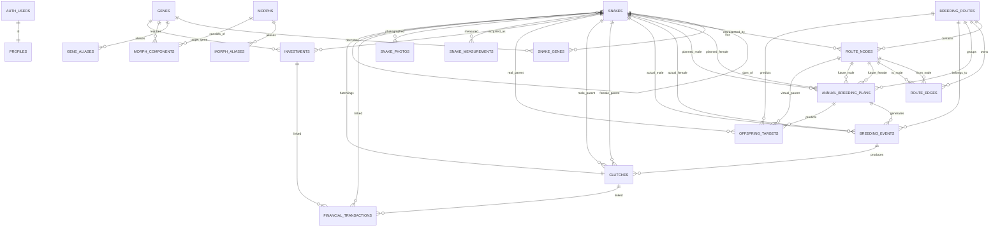

# Suoha Hognose Breeding OS — Database Schema & Relationship Guide

> **Document purpose**
>
> This is the canonical developer-facing explanation of the current Suoha Hognose database.
> It documents the meaning of every application table, every important field, foreign-key behavior,
> cross-table workflows, authentication/RLS, and the intended data lifecycle.
>
> **Scope:** the application owns **24 tables in the `public` schema**. Supabase also owns system
> tables such as `auth.users` and Storage internals; this document explains only the system tables
> that directly participate in the application architecture.

---

# 1. High-level architecture

```text
Browser / Netlify frontend
        │
        │ Supabase JS v2
        │ publishable key + user JWT
        ▼
Supabase
├── Auth
│   └── auth.users
│        │
│        ▼
│   public.profiles
│
├── Core animal & genetics
│   ├── snakes
│   ├── genes
│   ├── gene_aliases
│   ├── snake_genes
│   ├── morphs
│   ├── morph_aliases
│   └── morph_components
│
├── Multi-generation planning
│   ├── breeding_routes
│   ├── route_nodes
│   ├── route_edges
│   ├── annual_breeding_plans
│   ├── offspring_targets
│   └── investments
│
├── Real breeding operations
│   ├── breeding_events
│   └── clutches
│
└── Longitudinal / media / finance
    ├── snake_measurements
    ├── snake_photos
    ├── financial_transactions
    └── investment_expenses

└── Auditable AI decision layer
    ├── planning_scenarios
    ├── ai_prompt_templates
    ├── analysis_runs
    ├── ai_recommendations
    ├── ai_conversations
    └── ai_conversation_messages
```

The most important conceptual separation is:

```text
PLAN
annual_breeding_plans / breeding_routes / route_nodes
        ↓

REAL ACTION
breeding_events
        ↓

REAL BIOLOGICAL OUTPUT
clutches
        ↓

REAL INDIVIDUALS
snakes
```

A planned F1/F2 node is **not a real snake**. A hatchling becomes a real `snakes` row only after it
actually exists.

---

# 2. Complete table inventory

| Domain | Table | Purpose | Initial seed rows |
| --- | --- | --- | --- |
| Auth | profiles | Application role/profile linked 1:1 to Supabase Auth user | depends on Auth |
| Animals | snakes | All real individuals, purchased or produced | 32 |
| Genetics | genes | Canonical atomic gene/trait dictionary | 17 |
| Genetics | gene_aliases | Human shorthand/parser aliases | 23 |
| Genetics | snake_genes | Normalized genotype/trait state for each snake | 108 |
| Genetics | morphs | Named multi-gene combinations such as Mai Tai / Acid Rain | 5 |
| Genetics | morph_aliases | Extra aliases for named composite morphs, e.g. 爆炸 → 太阳爆炸 | live/user-maintained |
| Genetics | morph_components | Atomic requirements making up each named morph | 11 |
| Planning | breeding_routes | Multi-generation breeding projects | 6 |
| Planning | route_nodes | Graph nodes for snakes, future offspring, targets and gaps | 29 |
| Planning | route_edges | Directed graph connections between route nodes | 23 |
| Planning | annual_breeding_plans | Year-by-year intended pairings/project capacity | 40 |
| Operations | breeding_events | Actual mating attempts / breeding sessions | 0 |
| Operations | clutches | Actual egg/clutch/hatch records | 0 |
| Planning/Genetics | offspring_targets | Predicted/planned offspring outcomes and probabilities | 0 |
| Investment | investments | Acquisition/system investment plans | 4 |
| Tracking | snake_measurements | Weight/length/condition time series | 0 |
| Media | snake_photos | Photo metadata; actual binary files live in Storage | 0 |
| Finance | financial_transactions | Purchase/sale/feed/equipment/etc. transactions | 0 |
| Finance | investment_expenses | User-entered investment expense ledger for population/equipment/consumables | grows |
| AI planning | planning_scenarios | Formal baseline and reviewable planning scenarios | 1+ |
| AI governance | ai_prompt_templates | Versioned fixed system prompts; only one active version per workflow | 4+ |
| AI audit | analysis_runs | Immutable source snapshot, model, prompt version and structured AI output | grows |
| AI review | ai_recommendations | Reviewable, non-self-executing recommendations extracted from an analysis run | grows |
| AI conversation | ai_conversations | One persistent follow-up conversation attached to each analysis run | grows |
| AI conversation | ai_conversation_messages | Ordered user/assistant messages in a conversation | grows |

---

# 3. Entity relationship diagram



---

# 4. Authentication layer

## 4.1 `auth.users` — Supabase-managed system table

This is **not an application-owned public table**. Supabase Auth manages it.

Purpose:

- login identity
- email
- password credential
- email confirmation state
- session/JWT identity

The application must **never create a password column** in `public.profiles`.

Important relationship:

```text
auth.users.id
    │ UUID
    ▼
public.profiles.id
```

The JWT exposes the logged-in user's UUID through:

```sql
auth.uid()
```

RLS uses that UUID to determine application permissions.

---

## 4.2 `public.profiles`

### Purpose

Stores application-level authorization and display information for an Auth user.

One Auth user has exactly one application profile.

### Fields

| Field | Type | Required / Default | Relationship / Constraint | Meaning |
| --- | --- | --- | --- | --- |
| id | uuid | PK, required | FK → auth.users.id, ON DELETE CASCADE | Same UUID as the Supabase Auth user. |
| email | text | nullable | Synced from auth.users | Convenience copy of the login email. |
| display_name | text | nullable | — | Name shown by the application. |
| role | text | required; default `viewer` | viewer / editor / admin | Application authorization role. |
| active | boolean | required; default true | — | Master switch for application authorization. |
| created_at | timestamptz | default now() | — | Profile creation time. |
| updated_at | timestamptz | default now() | — | Profile update time. |

### Role semantics

```text
viewer
  authenticated read-only

editor
  read + CRUD on application/business tables

admin
  editor capabilities
  + read/update application profiles/roles
```

Two helper functions implement role checks:

```sql
public.can_edit_app()
public.is_app_admin()
```

### Auth synchronization

A trigger on `auth.users`:

```text
new Auth user
    ↓
handle_auth_user_profile()
    ↓
public.profiles row created automatically
    ↓
default role = viewer
```

Email updates are also synchronized.

---

# 5. Animal core

## 5.1 `public.snakes`

### Purpose

Central entity representing every **real individual snake**.

It includes:

- existing purchased stock
- future purchased stock
- actual hatchlings retained/sold
- ancestry links
- lifecycle state

It should **not** contain imaginary F1/F2 animals before they hatch.

### Primary key convention

Legacy seed collection:

```text
S01 ... S32
```

Live collection:

```text
Use the individual IDs imported from the workbook, currently following the investor/user prefix convention:
suohama -> M...
suohayu -> Y...
```

New UI-created individuals should generate the next available ID for the current user's prefix range and
must not collide with existing live IDs.

### Fields

| Field | Type | Required / Default | Relationship / Constraint | Meaning |
| --- | --- | --- | --- | --- |
| id | text | PK, required | unique | Permanent business ID such as S27. |
| series | text | required | — | Human project/line grouping such as 极端红, Mai Tai, 巧克力. |
| gene_text | text | required | — | Original human-readable genetic/morph description. |
| sex | text | required | F / M / U | Female / Male / Unknown. |
| birth_date | date | nullable | — | Birth/hatch date; current imported month-level values use first day of month. |
| mature_date | date | nullable | — | Planned/estimated breeding maturity date. |
| price | numeric(12,2) | required; default 0 | ≥ 0 | Recorded acquisition cost/reference cost. |
| investor | text | nullable | — | Investor/co-funding label from original data. |
| strategic_score | smallint | nullable | 0–100 | Planning/network importance heuristic, not market value. |
| role | text | nullable | — | Human-readable strategic role, e.g. 枢纽公. |
| status | text | required; default active | active / sold / deceased / retired / planned | Lifecycle state. |
| origin | text | required; default purchased | purchased / produced / other | How the individual entered the collection. |
| sire_id | text | nullable | FK → snakes.id, ON DELETE SET NULL | Father. |
| dam_id | text | nullable | FK → snakes.id, ON DELETE SET NULL | Mother. |
| clutch_id | bigint | nullable | FK → clutches.id, ON DELETE SET NULL | Clutch from which a produced animal hatched. |
| notes | text | nullable | — | Freeform notes. |
| created_at | timestamptz | default now() | — | Creation timestamp. |
| updated_at | timestamptz | default now(); auto trigger | — | Automatically refreshed on update. |

### Self-referential pedigree

```text
S26 ♀ + S27 ♂
       │
       ▼
Clutch #12
       │
       ▼
S33
dam_id  = S26
sire_id = S27
clutch_id = 12
origin = produced
```

This design means pedigree can continue indefinitely through the same table.

### Important delete behavior

`sire_id`, `dam_id`, `clutch_id` use `SET NULL`, while several operational references use
`RESTRICT`.

Therefore destructive deletion of meaningful historical snakes should generally be avoided.
Prefer:

```text
status = sold
status = retired
status = deceased
```

---

# 6. Genetics layer

## 6.1 `public.genes`

### Purpose

Canonical dictionary of **atomic genes/traits**.

Examples:

```text
axanthic
sable
toffee_belly
conda
arctic
lavender
```

Named multi-gene combinations such as Acid Rain are **not** atomic genes.

The current frontend exposes this table in `数据与审核看板 → 原子基因`. Editors can create or update atomic definitions there; when a purchased snake introduces a gene that is not in the dictionary yet, the snake editor offers a `维护原子基因` shortcut into this table.

### Fields

| Field | Type | Required / Default | Constraint | Meaning |
| --- | --- | --- | --- | --- |
| id | text | PK | — | Stable machine ID such as `axanthic`. |
| code | text | nullable | UNIQUE | Short code such as AXANTHIC. |
| name_zh | text | required | — | Chinese display name. |
| name_en | text | nullable | — | English display name. |
| inheritance_type | text | required; default unknown | recessive / incomplete_dominant / dominant / polygenic / line_trait / unknown | Inheritance category. |
| locus | text | nullable | — | Locus/category identifier where meaningful. |
| description | text | nullable | — | Definition and caveats. |
| created_at | timestamptz | default now() | — | Creation timestamp. |

---

## 6.2 `public.gene_aliases`

### Purpose

Parser dictionary translating user shorthand into atomic gene concepts.

Example:

```text
超康
  ↓
gene_id = conda
state_hint = super
```

### Fields

| Field | Type | Required / Default | Relationship / Constraint | Meaning |
| --- | --- | --- | --- | --- |
| alias | text | PK | — | Human shorthand/token. |
| gene_id | text | required | FK → genes.id, ON DELETE CASCADE | Atomic gene represented by the alias. |
| state_hint | text | nullable | visual / het / possible_het / super / line_trait / unknown | Suggested genotype state implied by the alias. |
| probability_hint | numeric(5,4) | nullable | 0–1 | Suggested probability for phrases like 50%/66% het. |
| notes | text | nullable | — | Parser caveats. |

### Why composite morph names do not belong here

This table is one alias → one gene.

But:

```text
Mai Tai = Sable + Toffee Belly
Acid Rain = Axanthic + Sable + Toffee Belly
```

Therefore these must be represented through `morphs + morph_aliases + morph_components`.

---

## 6.3 `public.snake_genes`

### Purpose

Normalized genotype/trait state of a real snake.

This is the main genetic source of truth for the inheritance engine.

### Composite primary key

```text
(snake_id, gene_id)
```

So one snake has at most one current normalized state for each atomic gene.

### Fields

| Field | Type | Required / Default | Relationship / Constraint | Meaning |
| --- | --- | --- | --- | --- |
| snake_id | text | required; PK part | FK → snakes.id, ON DELETE CASCADE | Individual being described. |
| gene_id | text | required; PK part | FK → genes.id, ON DELETE CASCADE | Atomic gene/trait. |
| state | text | required | visual / het / possible_het / super / line_trait / unknown | Observed/inferred genotype state. |
| probability | numeric(5,4) | required; default 1 | 0–1 | Probability that the stated uncertain carrier state is true. |
| source | text | default manual | — | Where this normalization came from. |
| notes | text | nullable | — | Parsing or pedigree caveats. |

### Examples

```text
S27 缺黄超康隐迈泰

snake_id | gene_id       | state  | probability
---------|---------------|--------|------------
S27      | axanthic      | visual | 1.00
S27      | conda         | super  | 1.00
S27      | sable         | het    | 1.00
S27      | toffee_belly  | het    | 1.00
```

Possible het:

```text
S12 66紫貂

gene_id = sable
state = possible_het
probability = 0.66
```

Do not convert 66% or 50% possible het into definite `het`.

---

## 6.4 `public.morphs`

### Purpose

Dictionary of **named composite morphs / local shorthand**.

Examples:

```text
mai_tai
toxic
stormcloud
acid_rain
double_super
```

### Fields

| Field | Type | Required / Default | Constraint | Meaning |
| --- | --- | --- | --- | --- |
| id | text | PK | — | Stable machine ID. |
| name_zh | text | required | — | Chinese display name. |
| name_en | text | nullable | — | English display name. |
| morph_type | text | required; default named_combo | named_combo / local_shorthand / line_name / unknown | Whether this is a standard named combo, local shorthand, line name, or uncertain label. |
| description | text | nullable | — | Definition. |
| created_at | timestamptz | default now() | — | Creation timestamp. |

The frontend exposes this table in `数据与审核看板 → 组合黑话`, together with `morph_aliases` and `morph_components`.

---

## 6.5 `public.morph_aliases`

### Purpose

Extra human-facing aliases for a named composite morph.

Example:

```text
太阳爆炸
  primary morph row: morphs.id = sunburst
  alias row: alias = 爆炸, morph_id = sunburst
```

This lets a gene text such as `雪白爆炸` match both `雪白` and `爆炸`, then merge the underlying atomic requirements without duplicating shared genes such as `albino`.

### Fields

| Field | Type | Required / Default | Relationship / Constraint | Meaning |
| --- | --- | --- | --- | --- |
| alias | text | PK | non-empty; unique case-insensitive index recommended | Extra token users may type. |
| morph_id | text | required | FK → morphs.id, ON DELETE CASCADE | Composite morph represented by this alias. |
| notes | text | nullable | — | Human caveats or source notes. |
| created_at | timestamptz | default now() | — | Creation timestamp. |
| updated_at | timestamptz | default now() | — | Last update timestamp. |

Do not use `morph_aliases` for one-gene nicknames. Those belong in `gene_aliases`.

---

## 6.6 `public.morph_components`

### Purpose

Defines what atomic states must all be satisfied for a named morph.

### Composite primary key

```text
(morph_id, gene_id)
```

### Fields

| Field | Type | Required | Relationship / Constraint | Meaning |
| --- | --- | --- | --- | --- |
| morph_id | text | PK part | FK → morphs.id, ON DELETE CASCADE | Named composite morph. |
| gene_id | text | PK part | FK → genes.id, ON DELETE CASCADE | Required atomic gene. |
| required_state | text | required | visual / het / possible_het / super / line_trait / unknown | Required state for morph recognition. Most named combos should use `visual` or `super`. |
| notes | text | nullable | — | Human explanation. |

### Current composite logic

```text
Mai Tai
  sable = visual
  toffee_belly = visual

Toxic
  axanthic = visual
  toffee_belly = visual

Stormcloud
  axanthic = visual
  sable = visual

Acid Rain
  axanthic = visual
  sable = visual
  toffee_belly = visual

双超 / Double Super
  arctic = super
  conda = super
```

### Text parsing flow

```text
gene_text
    ↓
match gene_aliases, morph primary names, and morph_aliases
    ↓
expand matched morphs through morph_components
    ↓
write/review snake_genes atomic rows
```

### Derived display flow

```text
snake_genes
    ↓
atomic states
    ↓
all requirements satisfied?
    ↓ yes
derive morph display name from morphs
```

A morph should be **derived**, not redundantly inserted into `snake_genes`.

---

## 6.7 Mendelian probability engine

`js/genetics.js` consumes the live `genes`, `snake_genes`, `morphs`, and `morph_components` snapshot on the pairing-laboratory page. It calculates only loci that have a Mendelian inheritance model:

- recessive: `visual`, `het`, and `possible_het` (the latter keeps its configured probability);
- dominant / incomplete-dominant: `visual` and `super`;
- same `genes.locus`: alternative alleles at one locus rather than independent traits.

It deliberately does **not** calculate `unknown`, `polygenic`, or `line_trait` rows, records whose states cannot form a valid diploid locus, linkage, or joint possible-het correlation. The UI labels those cases instead of returning false precision.

`genes.inheritance_type` describes the mutation; `snake_genes.state` describes an individual. Thus changing Skullface from `unknown` to `incomplete_dominant` in `genes` does not automatically change a pre-existing `snake_genes.state = unknown`. Migration `011_correct_skullface_and_frosted_metadata.sql` backfills only existing Skullface rows to `visual`.

For the current curated genetics policy, Skullface is modeled as an incomplete-dominant trait; Frosted remains unknown pending provenance because published hobby references conflict on whether it is a Caramel + Hypo combo or an independently inherited trait. Do not group Frosted with Caramel in the same `locus` until direct pedigree or breeding evidence is recorded.

### Confirmed stock corrections (2026-08)

The following corrections are stored in migration `012_resolve_s21_s22_s31_genotypes.sql`. They update both the human-readable `snakes.gene_text` and the authoritative atomic rows in `snake_genes`.

| Snake | Sex | Confirmed display genotype | `snake_genes` result |
| --- | --- | --- | --- |
| S21 | F | 白化北极康隐薰巧 | `albino=visual`, `arctic=visual`, `conda=visual`, `lavender=het`, `swiss_chocolate=visual` |
| S22 | M | 白化康隐薰巧 | `albino=visual`, `conda=visual`, `lavender=het`, `swiss_chocolate=visual`; no `arctic` row |
| S31 | F | 超北薰衣草 | `arctic=super`, `lavender=visual`; no `conda` row |

---

# 7. Multi-generation breeding route layer

## 7.1 `public.breeding_routes`

### Purpose

Top-level breeding project.

Examples:

```text
旗舰 · 酸雨核心
桥接 · Mai Tai → 酸雨
复合 · 巧克力
品质 · 极端红
```

A route is not one mating; it can span multiple generations.

### Fields

| Field | Type | Required / Default | Constraint | Meaning |
| --- | --- | --- | --- | --- |
| id | text | PK | — | Stable route/project ID, e.g. `flagship`. |
| name | text | required | — | Display name. |
| series | text | nullable | — | Series/project grouping. |
| objective | text | nullable | — | Long-term breeding objective. |
| status | text | required; default active | active / planned / paused / completed / archived | Project lifecycle. |
| priority | smallint | nullable | 1–100 | Project priority. |
| start_year | integer | nullable | 2000–2200 | Planning start year. |
| notes | text | nullable | — | Additional description. |
| created_at | timestamptz | default now() | — | Creation timestamp. |

---

## 7.2 `public.route_nodes`

### Purpose

Nodes displayed on the multi-generation breeding graph.

A node may represent:

```text
real snake
planned offspring
investment gap
target
```

### Fields

| Field | Type | Required / Default | Relationship / Constraint | Meaning |
| --- | --- | --- | --- | --- |
| id | text | PK | — | Graph-node ID. Real snake nodes are route-scoped, e.g. flagship_S27. |
| route_id | text | required | FK → breeding_routes.id, ON DELETE CASCADE | Owning route. |
| node_type | text | required | snake / planned_offspring / investment_gap / target | Semantic type. |
| snake_id | text | nullable | FK → snakes.id, ON DELETE SET NULL | Real individual represented by this node, if any. |
| label | text | required | — | Primary graph label. |
| subtitle | text | nullable | — | Secondary display text. |
| planned_year | integer | nullable | 2000–2200 | Expected activation/generation year. |
| strategic_score | smallint | nullable | 0–100 | Importance of this node to the route. |
| is_key | boolean | required; default false | — | Whether this is a key retention/bridge node. |
| x | numeric(10,2) | nullable | — | Graph X coordinate. |
| y | numeric(10,2) | nullable | — | Graph Y coordinate. |
| detail | text | nullable | — | Inspector/detail copy. |
| created_at | timestamptz | default now() | — | Creation timestamp. |

### Why the same snake can have multiple route nodes

S27 may participate in both flagship and bridge routes:

```text
flagship_S27 ── snake_id = S27
bridge_S27   ── snake_id = S27
```

These are not duplicate snakes. They are distinct visual/project placements of one real individual.

### Route editor in the application

On the **繁殖路线图** page, an `editor` or `admin` can select **编辑当前路线** to create a real-snake node, change its label, coordinates, strategic score, or key status, and create or delete directed edges. Adding a snake creates a route-scoped node ID in the form `<route_id>_<snake_id>`; deleting a node relies on the database cascade to remove its related `route_edges`. This editor intentionally manages existing snakes and their graph placement only; planned offspring, gaps, and targets remain database-managed records.

---

## 7.3 `public.route_edges`

### Purpose

Directed connections between route nodes.

### Fields

| Field | Type | Required / Default | Relationship / Constraint | Meaning |
| --- | --- | --- | --- | --- |
| id | bigint identity | PK | auto-generated | Internal edge ID. |
| route_id | text | required | FK → breeding_routes.id, ON DELETE CASCADE | Owning route. |
| from_node_id | text | required | FK → route_nodes.id, ON DELETE CASCADE | Source node. |
| to_node_id | text | required | FK → route_nodes.id, ON DELETE CASCADE | Destination node. |
| edge_type | text | required | pair / next / gap / backcross / link | Meaning of the connection. |
| label | text | nullable | — | Optional display label. |
| notes | text | nullable | — | Optional notes. |

Uniqueness constraint:

```text
(route_id, from_node_id, to_node_id, edge_type)
```

### Edge semantics

```text
pair       parent/project inputs into planned offspring
next       generation/project progression
gap        dependency on missing investment/resource
backcross  explicit backcross direction
link       generic strategic link
```

---

# 8. Annual planning layer

## 8.1 `public.annual_breeding_plans`

### Purpose

Stores **intended yearly breeding/project decisions**.

This table answers:

```text
What do we plan to breed/do in year Y?
```

It does not prove that mating actually happened.

### Fields

| Field | Type | Required / Default | Relationship / Constraint | Meaning |
| --- | --- | --- | --- | --- |
| id | bigint identity | PK | auto-generated | Plan-row ID. |
| plan_year | integer | required | 2000–2200 | Planning year. |
| priority | text | required; default B | A / B / R / G / C | Execution/decision priority. |
| route_id | text | nullable | FK → breeding_routes.id, ON DELETE SET NULL | Associated multi-generation project. |
| project_name | text | required | — | Human-readable project title. |
| female_snake_id | text | nullable | FK → snakes.id, ON DELETE SET NULL | Known real female parent. |
| male_snake_id | text | nullable | FK → snakes.id, ON DELETE SET NULL | Known real male parent. |
| female_node_id | text | nullable | FK → route_nodes.id, ON DELETE SET NULL | Future/virtual female-side route node. |
| male_node_id | text | nullable | FK → route_nodes.id, ON DELETE SET NULL | Future/virtual male-side route node. |
| goal | text | nullable | — | Why the pairing/project exists. |
| mode | text | nullable | — | Same-series, strategic cross, conditional, etc. |
| status | text | required; default planned | planned / ready / conditional / completed / cancelled / investment_gap | Plan state. |
| planned_clutches | integer | required; default 1 | ≥ 0 | Capacity allocation. 0 can mean reserve/gap/observation. |
| notes | text | nullable | — | Additional planning notes. |
| created_at | timestamptz | default now() | — | Creation timestamp. |

### Priority convention

```text
A = highest priority
B = secondary
R = reserve
G = investment gap
C = conditional/future
```

### Real and virtual participants

A plan may reference:

- real snake IDs, or
- future route nodes before the future animal exists.

That is why both `snake_id` and `node_id` columns exist.

---

# 9. Actual breeding operations

## 9.1 `public.breeding_events`

### Purpose

Records an **actual mating attempt/session**.

This is the bridge between plan and reality.

### Fields

| Field | Type | Required / Default | Relationship / Constraint | Meaning |
| --- | --- | --- | --- | --- |
| id | bigint identity | PK | auto-generated | Actual breeding event ID. |
| plan_id | bigint | nullable | FK → annual_breeding_plans.id, ON DELETE SET NULL | Plan that led to this event. |
| route_id | text | nullable | FK → breeding_routes.id, ON DELETE SET NULL | Strategic project. |
| female_snake_id | text | required | FK → snakes.id, ON DELETE RESTRICT | Actual female used. |
| male_snake_id | text | required | FK → snakes.id, ON DELETE RESTRICT | Actual male used. |
| paired_at | date | nullable | — | Start/first pairing date. |
| ended_at | date | nullable | — | End of pairing window. |
| status | text | required; default paired | planned / paired / observed_copulation / successful / unsuccessful / cancelled | Operational outcome/status. |
| notes | text | nullable | — | Observation notes. |
| created_at | timestamptz | default now() | — | Creation timestamp. |

### Why parent FKs use `RESTRICT`

Once a real breeding event references an individual, deleting that snake would destroy operational history.

Therefore:

```text
DELETE snake
    ↓
blocked if breeding_events references it
```

This is intentional.

---

## 9.2 `public.clutches`

### Purpose

Records actual egg laying, fertility and hatching results.

### Fields

| Field | Type | Required / Default | Relationship / Constraint | Meaning |
| --- | --- | --- | --- | --- |
| id | bigint identity | PK | auto-generated | Internal clutch ID. |
| clutch_code | text | nullable | UNIQUE | Human-friendly clutch code. |
| breeding_event_id | bigint | nullable | FK → breeding_events.id, ON DELETE SET NULL | Breeding event that produced the clutch. |
| female_snake_id | text | required | FK → snakes.id, ON DELETE RESTRICT | Dam. |
| male_snake_id | text | required | FK → snakes.id, ON DELETE RESTRICT | Sire. |
| laid_date | date | nullable | — | Egg laying date. |
| egg_count | integer | nullable | ≥ 0 | Total eggs. |
| fertile_egg_count | integer | nullable | ≥ 0 | Fertile eggs. |
| hatched_count | integer | nullable | ≥ 0 | Hatched offspring. |
| incubation_temp_c | numeric(5,2) | nullable | — | Incubation temperature in °C. |
| hatch_start_date | date | nullable | — | First hatch date. |
| hatch_end_date | date | nullable | — | Last hatch date. |
| status | text | required; default incubating | incubating / hatched / failed / archived | Clutch lifecycle. |
| notes | text | nullable | — | Incubation/hatching notes. |
| created_at | timestamptz | default now() | — | Creation timestamp. |

### Clutch → offspring flow

```text
breeding_event
   ↓
clutch
   ↓
real hatchlings
   ↓
snakes rows
```

Each hatchling should store:

```text
dam_id
sire_id
clutch_id
origin = produced
```

---

# 10. Predicted offspring layer

## 10.1 `public.offspring_targets`

### Purpose

Stores predicted/planned outcomes used by the future inheritance engine and route planning.

It is not a hatchling inventory table.

### Fields

| Field | Type | Required / Default | Relationship / Constraint | Meaning |
| --- | --- | --- | --- | --- |
| id | bigint identity | PK | auto-generated | Target/outcome ID. |
| route_id | text | nullable | FK → breeding_routes.id, ON DELETE CASCADE | Route this target belongs to. |
| annual_plan_id | bigint | nullable | FK → annual_breeding_plans.id, ON DELETE SET NULL | Annual plan that generated it. |
| female_snake_id | text | nullable | FK → snakes.id, ON DELETE SET NULL | Real female input. |
| male_snake_id | text | nullable | FK → snakes.id, ON DELETE SET NULL | Real male input. |
| female_node_id | text | nullable | FK → route_nodes.id, ON DELETE SET NULL | Virtual/future female-side input. |
| male_node_id | text | nullable | FK → route_nodes.id, ON DELETE SET NULL | Virtual/future male-side input. |
| generation | text | required; default F1 | — | F1 / F2 / backcross etc. |
| label | text | required | — | Human-friendly outcome name. |
| genotype_text | text | nullable | — | Serialized/human-readable genotype result. Future engine may need richer normalized structure. |
| phenotype_text | text | nullable | — | Display phenotype/morph description. |
| probability | numeric(8,6) | nullable | 0–1 | Probability of this predicted outcome. |
| target_year | integer | nullable | 2000–2200 | Expected project year. |
| is_key_candidate | boolean | required; default false | — | Whether this is a key retention target. |
| strategic_score | smallint | nullable | 0–100 | Planning value. |
| notes | text | nullable | — | Genetic/planning caveats. |
| created_at | timestamptz | default now() | — | Creation timestamp. |

### Intended future use

```text
Parents
   ↓
inheritance engine
   ↓
possible genotype outcomes
   ↓
offspring_targets
   ↓
derive named morphs
   ↓
rank key-retention targets
```

---

# 11. Investment layer

## 11.1 `public.investments`

### Purpose

Treats future animal acquisition and system improvements as strategic capital allocation.

### Fields

| Field | Type | Required / Default | Relationship / Constraint | Meaning |
| --- | --- | --- | --- | --- |
| id | text | PK | — | Investment ID such as I01. |
| name | text | required | — | Investment name. |
| category | text | required; default snake | snake / infrastructure / data / other | Investment class. |
| status | text | required; default planned | planned / watching / purchased / rejected / completed | Lifecycle. |
| rank | integer | nullable | — | Priority ranking. |
| strategic_score | smallint | nullable | 0–100 | Strategic attractiveness. |
| target_gene_id | text | nullable | FK → genes.id, ON DELETE SET NULL | Specific atomic gene target if applicable. |
| target_sex | text | nullable | F / M / U | Desired sex. |
| budget_min | numeric(12,2) | nullable | ≥ 0 | Lower expected budget. |
| budget_max | numeric(12,2) | nullable | ≥ 0 | Upper expected budget. |
| actual_cost | numeric(12,2) | nullable | ≥ 0 | Realized acquisition/system cost. |
| planned_year | integer | nullable | 2000–2200 | Expected acquisition year. |
| acquired_snake_id | text | nullable | FK → snakes.id, ON DELETE SET NULL | Real snake obtained from this investment. |
| thesis | text | nullable | — | Why this investment matters. |
| criteria | jsonb | required; default [] | JSON array/object | Screening criteria. |
| notes | text | nullable | — | Additional notes. |
| created_at | timestamptz | default now() | — | Creation timestamp. |

### Investment → actual animal linkage

```text
investment I02
   status = watching
       ↓ purchase
   status = purchased
   actual_cost = ...
       ↓
new snakes row S33
       ↓
investments.acquired_snake_id = S33
```

---

# 12. Longitudinal animal tracking

## 12.1 `public.snake_measurements`

### Purpose

Stores time-series physical/condition data.

### Fields

| Field | Type | Required / Default | Relationship / Constraint | Meaning |
| --- | --- | --- | --- | --- |
| id | bigint identity | PK | auto-generated | Measurement record. |
| snake_id | text | required | FK → snakes.id, ON DELETE CASCADE | Measured animal. |
| measured_at | date | required; default current_date | — | Measurement date. |
| weight_g | numeric(10,2) | nullable | ≥ 0 | Weight in grams. |
| length_cm | numeric(10,2) | nullable | ≥ 0 | Length in centimeters. |
| feeding_status | text | nullable | — | Feeding state/context. |
| condition_note | text | nullable | — | Body condition / breeding readiness note. |
| notes | text | nullable | — | Other observation. |
| created_at | timestamptz | default now() | — | Creation timestamp. |

This table is intended to support maturity/readiness decisions later rather than relying only on a fixed
`mature_date`.

---

# 13. Photos / Supabase Storage

## 13.1 `public.snake_photos`

### Purpose

Stores photo metadata. It does **not** store binary image data.

Actual files should live in Supabase Storage, typically a bucket such as:

```text
snake-photos
```

### Fields

| Field | Type | Required / Default | Relationship / Constraint | Meaning |
| --- | --- | --- | --- | --- |
| id | bigint identity | PK | auto-generated | Photo metadata ID. |
| snake_id | text | required | FK → snakes.id, ON DELETE CASCADE | Animal in the image. |
| storage_bucket | text | required; default snake-photos | — | Supabase Storage bucket. |
| storage_path | text | required | Together with bucket must be unique | Object path in Storage. |
| photo_date | date | nullable | — | Date image was taken. |
| is_primary | boolean | required; default false | — | Preferred profile image. |
| caption | text | nullable | — | Description. |
| created_at | timestamptz | default now() | — | Creation timestamp. |

Uniqueness:

```text
(storage_bucket, storage_path)
```

### Storage relationship

```text
Supabase Storage object
bucket/path
     │
     ▼
snake_photos.storage_bucket
snake_photos.storage_path
     │
     ▼
snake_id
```

---

# 14. Financial layer

## 14.1 `public.financial_transactions`

### Purpose

General financial ledger for animal and breeding economics.

### Fields

| Field | Type | Required / Default | Relationship / Constraint | Meaning |
| --- | --- | --- | --- | --- |
| id | bigint identity | PK | auto-generated | Transaction ID. |
| transaction_date | date | required; default current_date | — | Accounting date. |
| transaction_type | text | required | purchase / sale / feed / equipment / vet / breeding / shipping / other | Transaction category. |
| amount | numeric(12,2) | required | ≥ 0 | Absolute transaction amount. Direction/sign convention should be handled consistently by application logic. |
| snake_id | text | nullable | FK → snakes.id, ON DELETE SET NULL | Individual-related transaction. |
| clutch_id | bigint | nullable | FK → clutches.id, ON DELETE SET NULL | Clutch/project-related transaction. |
| investment_id | text | nullable | FK → investments.id, ON DELETE SET NULL | Investment-plan-related transaction. |
| counterparty | text | nullable | — | Seller/buyer/vendor etc. |
| notes | text | nullable | — | Description. |
| created_at | timestamptz | default now() | — | Creation timestamp. |

### Important modeling note

`amount` is constrained to be non-negative. Therefore the application should define revenue/cost semantics
through `transaction_type` (or later add a direction field), rather than inserting negative amounts
without a schema migration.

---

# 15. Cross-table workflows

## 15.1 User login and authorization

```text
Email/password
    ↓
auth.users
    ↓ JWT / auth.uid()
public.profiles
    ↓
role + active
    ↓
RLS
    ↓
allowed SELECT / INSERT / UPDATE / DELETE
```

---

## 15.2 Snake genetics display

```text
snakes
  └─ S27

snake_genes
  ├─ axanthic visual
  ├─ conda super
  ├─ sable het
  └─ toffee_belly het
        │
        ▼
genes
  inheritance metadata
```

For visible genotype combinations:

```text
snake_genes
   ↓
morph_components
   ↓
morphs
   ↓
derived names shown in UI
```

---

## 15.3 Route graph

```text
breeding_routes
   ↓ 1:N
route_nodes
   ↓
route_edges
```

Real route node:

```text
route_nodes.snake_id
    ↓
snakes.id
```

Future F1/F2 route node:

```text
route_nodes.node_type = planned_offspring
snake_id = NULL
```

---

## 15.4 Annual plan → real mating → real clutch

```text
annual_breeding_plans
    │
    │ chosen for execution
    ▼
breeding_events
    │
    │ successful reproduction
    ▼
clutches
```

These tables must remain separate because:

```text
planned ≠ attempted ≠ successful ≠ hatched
```

---

## 15.5 Clutch → real offspring

```text
clutches.id
      ↓
snakes.clutch_id

clutches.female_snake_id ──→ snakes.dam_id
clutches.male_snake_id   ──→ snakes.sire_id
```

This is the core lineage/pedigree mechanism.

---

## 15.6 Genetics engine → predicted target

```text
female snake_genes
+
male snake_genes
    ↓
inheritance calculation
    ↓
offspring_targets
    ↓
morph recognition
    ↓
route key-candidate selection
```

---

## 15.7 Investment → acquisition → finance

```text
investments
   ↓ purchase decision
snakes
   ↑ acquired_snake_id

financial_transactions
   ├─ investment_id
   └─ snake_id
```

This allows future ROI analysis:

```text
investment cost
+
ongoing costs
+
clutch production
+
sales revenue
```

---

## 15.8 Measurement-driven breeding readiness

Current design still has:

```text
snakes.mature_date
```

Future decision support can combine:

```text
mature_date
+
snake_measurements.weight_g
+
feeding_status
+
condition_note
```

to decide actual breeding readiness.

---

# 16. Foreign-key delete behavior

Delete behavior is deliberately mixed.

| Relationship | ON DELETE | Reason |
| --- | --- | --- |
| profiles.id → auth.users.id | CASCADE | Deleting Auth identity removes its app profile. |
| gene_aliases.gene_id → genes.id | CASCADE | Alias is meaningless without gene. |
| snake_genes.snake_id → snakes.id | CASCADE | Genotype rows belong exclusively to snake. |
| snake_genes.gene_id → genes.id | CASCADE | Normalized state cannot exist without gene definition. |
| morph_aliases.morph_id → morphs.id | CASCADE | Aliases belong to a named composite morph. |
| morph_components.morph_id → morphs.id | CASCADE | Components belong to morph. |
| morph_components.gene_id → genes.id | CASCADE | Component requires gene. |
| route_nodes.route_id → breeding_routes.id | CASCADE | Deleting a route removes its graph. |
| route_nodes.snake_id → snakes.id | SET NULL | Route history can survive if snake record is removed. |
| route_edges → route/nodes | CASCADE | Edges cannot exist without graph. |
| annual plan route/snake/node refs | SET NULL | Planning record can survive changes in referenced entities. |
| breeding_events parent snakes | RESTRICT | Protect actual breeding history. |
| clutches parent snakes | RESTRICT | Protect real reproductive history. |
| clutches.breeding_event_id | SET NULL | Clutch record remains useful even if event reference is removed. |
| snakes.sire_id / dam_id | SET NULL | Avoid cascade-deleting descendants. |
| snakes.clutch_id | SET NULL | Individual remains even if clutch relation removed. |
| measurements/photos.snake_id | CASCADE | These records belong entirely to snake. |
| finance links | SET NULL | Ledger record should survive deletion of linked business entity. |
| investments.acquired_snake_id | SET NULL | Investment record can survive animal lifecycle changes. |

**Operational recommendation:** do not casually delete real snakes, clutches or events. Prefer lifecycle
status fields for historical integrity.

---

# 17. Indexes currently defined

Important explicit indexes:

```text
snakes:
  idx_snakes_series
  idx_snakes_sex
  idx_snakes_mature_date
  idx_snakes_status

snake_genes:
  idx_snake_genes_gene_id

route_nodes:
  idx_route_nodes_route_id
  idx_route_nodes_snake_id

route_edges:
  idx_route_edges_route_id

annual_breeding_plans:
  idx_annual_plans_year

breeding_events:
  idx_breeding_events_female
  idx_breeding_events_male

clutches:
  idx_clutches_female
  idx_clutches_male

morph_components:
  idx_morph_components_gene_id

morph_aliases:
  idx_morph_aliases_alias_lower
  idx_morph_aliases_morph_id

snake_measurements:
  idx_measurements_snake_date

snake_photos:
  idx_snake_photos_snake_id

financial_transactions:
  idx_transactions_date
  idx_transactions_snake_id

profiles:
  idx_profiles_role
  idx_profiles_active
  idx_profiles_email
```

Primary keys and unique constraints also create PostgreSQL indexes automatically.

---

# 18. Current RLS / permission model

Target state is **private application mode**.

### Anonymous user (`anon`)

```text
No business-data SELECT
No INSERT
No UPDATE
No DELETE
```

### Authenticated `viewer`

```text
SELECT core application tables
No write
```

### Authenticated `editor`

```text
SELECT
INSERT
UPDATE
DELETE
```

for application tables according to RLS.

### Authenticated `admin`

Same business-data permissions as editor, plus profile/role management.

### Authorization functions

```sql
public.can_edit_app()
```

returns true when:

```text
profiles.id = auth.uid()
active = true
role ∈ {editor, admin}
```

```sql
public.is_app_admin()
```

returns true when:

```text
profiles.id = auth.uid()
active = true
role = admin
```

The frontend may hide buttons, but **RLS remains the security boundary**.

---

# 19. Current table access grouping

## Authenticated read tables

After private-app RLS is applied:

```text
snakes
genes
gene_aliases
snake_genes
morphs
morph_aliases
morph_components
breeding_routes
route_nodes
route_edges
annual_breeding_plans
investments
investment_expenses
```

## More private operational tables

Initial policy design restricts these to editor/admin:

```text
breeding_events
clutches
offspring_targets
snake_measurements
snake_photos
financial_transactions
```

If the product later needs viewers to see selected operational information, change RLS deliberately rather
than disabling it.

---

# 20. Database invariants

Developers should preserve these rules.

## 20.1 Atomic vs composite genetics

Correct:

```text
snake_genes:
axanthic visual
sable visual
toffee_belly visual

derived display:
Acid Rain
```

Incorrect:

```text
snake_genes:
acid_rain visual
```

as an independent atomic gene.

---

## 20.2 Planned offspring vs real snake

Correct:

```text
route_nodes:
O_A1 = planned_offspring
```

until hatch.

After hatch:

```text
snakes:
S33 = real individual
```

---

## 20.3 Plan vs actual event

Correct:

```text
annual_breeding_plans
→ breeding_events
→ clutches
```

Do not mark a plan as a real breeding event simply because the year arrived.

---

## 20.4 Historical entities

Use lifecycle states instead of destructive deletion where possible.

Examples:

```text
snakes.status
breeding_routes.status
annual_breeding_plans.status
investments.status
clutches.status
```

---

## 20.5 Auth

Never store passwords in `profiles`.
Never use a Supabase service-role/secret key in browser code.

---

# 21. Common joins / data access patterns

## 21.1 Get a snake with normalized genetics

```sql
select
  s.id,
  s.series,
  s.gene_text,
  sg.gene_id,
  g.name_zh,
  g.name_en,
  sg.state,
  sg.probability
from public.snakes s
left join public.snake_genes sg
  on sg.snake_id = s.id
left join public.genes g
  on g.id = sg.gene_id
where s.id = 'S27'
order by g.id;
```

---

## 21.2 Get a morph definition

```sql
select
  m.id,
  m.name_zh,
  array_remove(array_agg(distinct ma.alias), null) as aliases,
  mc.gene_id,
  mc.required_state
from public.morphs m
join public.morph_components mc
  on mc.morph_id = m.id
left join public.morph_aliases ma
  on ma.morph_id = m.id
where m.id = 'acid_rain'
group by m.id, m.name_zh, mc.gene_id, mc.required_state
order by mc.gene_id;
```

---

## 21.3 Load one breeding route graph

```sql
select *
from public.breeding_routes
where id = 'flagship';

select *
from public.route_nodes
where route_id = 'flagship';

select *
from public.route_edges
where route_id = 'flagship';
```

---

## 21.4 Get yearly plans with real parents

```sql
select
  p.*,
  f.gene_text as female_gene,
  m.gene_text as male_gene
from public.annual_breeding_plans p
left join public.snakes f
  on f.id = p.female_snake_id
left join public.snakes m
  on m.id = p.male_snake_id
where p.plan_year = 2028
order by p.priority, p.id;
```

---

## 21.5 Get actual breeding history for a snake

```sql
select *
from public.breeding_events
where female_snake_id = 'S26'
   or male_snake_id = 'S26'
order by paired_at desc;
```

---

## 21.6 Get descendants by direct parent

```sql
select *
from public.snakes
where sire_id = 'S27'
   or dam_id = 'S27';
```

Recursive pedigree/descendant queries can later use PostgreSQL recursive CTEs.

---

## 21.7 Get clutch and offspring

```sql
select *
from public.clutches
where id = 12;

select *
from public.snakes
where clutch_id = 12;
```

---

## 21.8 Get all measurements for an animal

```sql
select *
from public.snake_measurements
where snake_id = 'S26'
order by measured_at;
```

---

## 21.9 Estimate linked financial history

```sql
select *
from public.financial_transactions
where snake_id = 'S26'
order by transaction_date;
```

---

# 22. End-to-end example

Suppose the 2028 flagship plan is:

```text
S26 ♀ × S27 ♂
```

The database lifecycle should be:

```text
1. Existing real animals
   snakes.S26
   snakes.S27

2. Genetics
   snake_genes(S26, ...)
   snake_genes(S27, ...)

3. Strategy
   breeding_routes.flagship
   route_nodes(flagship_S26, flagship_S27, O_A1, ...)
   route_edges(...)

4. Annual plan
   annual_breeding_plans
   plan_year = 2028
   female_snake_id = S26
   male_snake_id = S27
   route_id = flagship

5. Actual mating
   breeding_events
   plan_id = <2028 plan>
   female_snake_id = S26
   male_snake_id = S27

6. Actual clutch
   clutches
   breeding_event_id = ...
   female_snake_id = S26
   male_snake_id = S27
   egg_count / fertile_egg_count / hatched_count

7. Hatchling exists
   snakes.S33
   origin = produced
   dam_id = S26
   sire_id = S27
   clutch_id = <clutch>

8. Genetic typing/normalization
   snake_genes rows for S33

9. Route update
   Replace/associate previously planned O_A1 with the actual retained individual
   according to application logic.

10. Finance
   financial_transactions can record breeding costs, sale revenue, shipping, etc.
```

This chain is the core operating-system architecture of the project.

---

# 23. Areas intentionally not fully normalized yet

These are known design areas rather than bugs.

### `offspring_targets.genotype_text`

Currently a text representation is available. A rigorous genetics engine may eventually justify a normalized
offspring-outcome child table rather than storing only a serialized genotype string.

### `financial_transactions.amount`

Amounts are non-negative and transaction direction is implicit from `transaction_type`. A later accounting
model may add:

```text
direction
currency
quantity
unit_cost
```

if needed.

### Photo primary uniqueness

`snake_photos.is_primary` does not currently enforce exactly one primary photo per snake at the database
level. The frontend should manage this, or a future partial unique index/trigger can enforce it.

### Annual plan virtual participants

`female_node_id` / `male_node_id` allow future nodes but do not themselves enforce biological sex. The
application must validate planned role/sex when enough information exists.

### Possible-het joint dependence

Several uncertain genes from the same pedigree should not automatically be treated as independent when
building the inheritance engine.

---

# 24. Recommended developer mental model

Think of the schema as five connected systems:

```text
A. Identity
auth.users → profiles

B. Real biological truth
snakes → snake_genes → genes
snakes → pedigree / clutches / measurements

C. Human genetics vocabulary
gene_aliases
morphs → morph_aliases / morph_components

D. Strategic planning
breeding_routes → route_nodes → route_edges
annual_breeding_plans
offspring_targets
investments

E. Operational truth
breeding_events → clutches → produced snakes
financial_transactions
snake_photos
```

The most important rule is:

> **Planning tables describe what we want to happen; operational and animal tables describe what actually happened.**

---

# 25. AI decision and follow-up conversation layer

The AI layer is deliberately separated from biological truth and formal operations. It is an auditable planning aid, never a source of genetics, market, breeding-event, or inventory facts.

```text
ai_prompt_templates (versioned fixed instruction)
        ↓
analysis_runs (fact snapshot + model response)
        ├── ai_recommendations (review / accept / reject / optionally apply)
        └── ai_conversations (one conversation per run)
                 ↓
          ai_conversation_messages (persistent follow-ups)
```

### `public.ai_prompt_templates`

Holds the fixed server-side system prompt for `pairing`, `annual_plan`, `investment`, and `strategy_score`. `template_key + version` is unique. A template is read by authenticated users, but only `admin` may create, edit, or deactivate versions. The original prompt ID/version is copied to each `analysis_runs` record so past results remain reproducible after a template revision.

### `public.analysis_runs` and `public.ai_recommendations`

`analysis_runs.source_snapshot` is the structured, as-of-time input sent to the model. `response_payload` records the validated JSON response, while `model_name`, `prompt_template_id`, `prompt_version`, and `response_schema_version` provide provenance. `ai_recommendations` stores individual proposals with review status; acceptance is not execution.

Investment analyses have two snapshot scopes: `population` is the existing whole-population gap analysis, while `candidate_investment` evaluates one external, not-yet-owned candidate against the current population, routes, investments, and recent public market information. Its candidate snapshot may include `asking_price { amount, currency }`, `breeding_ready_at { year, month }`, `provenance_notes`, and `reference_notes`; `breeding_ready_at` means the earliest year/month when the candidate may be scheduled for breeding, not its birth date or general age. Nullable fields remain explicit so missing data is not mistaken for zero or a verified fact. Both use `analysis_type = investment`, but only population recommendations enter the investment review queue. Candidate evaluation uses DeepSeek Responses API server-side `web_search` and is stored as an `analysis_runs` snapshot with plain-language `response_payload.candidate_advice` plus normalized `response_payload.web_sources`; it never creates an investment record or enters review. Candidate `gene_text` is not treated as a genetic fact unless it resolves to a recorded atomic gene in `candidate.atomic_genes`. Web sources may support market, price, availability, scarcity, trend, and public seller-reputation judgments, but never fill missing individual genetics or pedigree facts.

### `public.ai_conversations`

Created once for an `analysis_run_id` (`unique`). It preserves the analysis type, the same fact snapshot, model identity, and original prompt version used by the initial analysis. Deleting an analysis run cascades to its conversation; no core animal or planning record is affected.

### `public.ai_conversation_messages`

Stores ordered `user`, `assistant`, or `system` messages. Initial assistant messages may retain the validated JSON in `structured_payload`; natural-language follow-up responses are stored in `content`. Messages are capped at 6,000 characters and cascade-delete only with their conversation.

### AI RLS and write boundary

Authenticated users can read AI audit and conversation data. `editor` and `admin` can create analyses and conversation messages; only `admin` can revise prompt templates. The Netlify Function authenticates the caller with the Supabase JWT and calls DeepSeek server-side. The browser never receives the DeepSeek key.

Run these additive migrations in order before enabling this feature:

```text
supabase/migrations/005_ai_decision_layer.sql
supabase/migrations/006_ai_conversations.sql
supabase/migrations/007_ai_prompt_templates_v3.sql
supabase/migrations/008_ai_review_workflow.sql
supabase/migrations/009_ai_review_backfill_links.sql
supabase/migrations/013_candidate_investment_prompt.sql
supabase/migrations/014_candidate_investment_plain_advice_prompt.sql
supabase/migrations/015_candidate_investment_web_search_prompt.sql
```

`008_ai_review_workflow.sql` keeps AI and manual decisions in the same business tables. `investments` and `annual_breeding_plans` carry `source_type` (`manual` / `ai`) and `review_status` (`pending` / `approved` / `returned`). AI rows reference their originating `ai_recommendations` record through `ai_recommendation_id`. Only approved records are rendered in the normal investment and annual-planning pages; pending AI records appear in the separate investment and annual review queues.

---

# 26. Short Codex handoff instructions

```text
Before changing database code:

1. Treat the existing Supabase database as live.
2. Do not DROP or recreate tables unless explicitly requested.
3. Preserve existing live snake IDs and the current M/Y prefix convention for newly created snakes.
4. Preserve atomic genes vs derived composite morphs.
5. Preserve annual plan vs actual breeding event vs clutch separation.
6. Preserve pedigree through sire_id, dam_id and clutch_id.
7. Preserve RLS; do not solve permission errors by disabling security.
8. Do not expose a service-role key in frontend code.
9. Prefer lifecycle status updates over destructive deletion of historical entities.
10. Any schema migration should be additive and reversible where possible.
```
