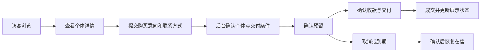

# Suoha Hognose 升级路线与需求建议

更新日期：2026-09-29

本文保留原有产品方向，并补充现有代码评估、后台升级建议、实施边界和验收标准。本文是升级路线，不代表所有功能均已实现。第 9–15 节为补充建议；阶段安排以第 14 节为准；当前代码交付范围见第 16 节。

项目升级方向：**对外的蛇只展示与购买网站 + 对内的繁殖经营后台，共用一套个体档案。**

关于注册，我的判断是：**浏览无需注册；第一版购买可以先走“提交意向 → 你确认 → 成交”，不必强制客户注册。** 等你需要在线付款、订单查询和售后档案时，再引入客户账户。

下面先按这个购买模式梳理，方便你判断整体方向。

## 1. 现在的项目基础

目前是一个登录后使用的内部工作台，已有种群管理、繁殖路线、年度产出、投资记账、配对实验室和 AI 审核。这些能力应该保留，成为新版后台。

对外展示需要补充公开目录、照片展示、独立详情页、上架管理和购买流程。现有代码里还没看到完整的商城下单链路。

有两个需要特别处理的地方：

* 现有 `price` 是购入成本，需要新增独立售价，避免把成本展示给客户。
* 当前 `viewer` 是内部只读角色，不能直接拿来作为普通客户角色。开放注册前，需要重新核对数据库权限。

这些判断来自项目的 [架构说明](ARCHITECTURE.md)、[数据模型说明](Database_Schema_Guide.md)、[项目上下文](Context.md) 和现有页面代码。UI 建议目前基于代码阅读，实施前仍需结合真实数据做浏览器和手机实测。

## 2. 前台和后台怎么组织

| 区域               | 面向谁       | 主要内容                                                  |
| ------------------ | ------------ | --------------------------------------------------------- |
| 公开网站           | 所有访客     | 首页、全部个体、血线／基因介绍、蛇只详情、购买说明        |
| 客户中心，后续增加 | 已登录客户   | 我的订单、收藏、到货通知、已购个体档案                    |
| 管理后台           | 你和授权成员 | 个体档案、照片、上架、购买意向、销售、繁殖、投资、AI 审核 |

前台使用顶部导航，围绕“发现喜欢的蛇 → 了解 → 购买”组织。

后台使用侧边导航，围绕日常工作组织：

* 工作概览：待处理购买意向、待补照片、待审核事项。
* 个体管理：基础资料、基因、亲本、照片、成长记录。
* 展示与销售：发布、定价、预留、成交记录。
* 繁殖管理：路线、配对实验室、年度计划。
* 经营管理：投资、支出、经营数据。
* 系统管理：账号权限、基因词典、AI 配置与审核。

这样，管理员登录后进入工作台；普通客户登录后进入自己的账户。**管理员登录的存在，并不意味着客户必须注册。**

## 3. 首页应该怎么做

你的“展示所有蛇的血线、基因、照片”的方向合理，但建议让首页负责导览，把完整内容放到可筛选的目录。

首页从上到下可以是：

1. **品牌首屏**：一张真实蛇只主图、一句品牌介绍，以及“查看在售个体”按钮。
2. **血线／系列入口**：每个分类展示代表照片、简短说明、公开个体数量。
3. **精选在售个体**：照片、编号、基因摘要、性别、出生年份、售价、销售状态。
4. **种蛇与繁殖成果**：展示你的育种特色，明确哪些仅供展示。
5. **购买流程与常见问题**：解释如何咨询、确认和交付。

“所有个体”页面再提供搜索和筛选：系列、基因、性别、出生年份、销售状态、价格区间。

这里还有一个概念要分清：**血线、基因、组合品系和亲本谱系，不应该混成同一个分类。** 现有 `series` 是项目／系列分组，不宜未经核实就全部标成血线。页面可以同时支持这些入口，但每个词的含义要准确。

## 4. 蛇只详情页

建议每条公开个体都有独立网址，方便分享、刷新和直接访问。

详情页按客户决策顺序展示：

| 模块     | 内容                                           |
| -------- | ---------------------------------------------- |
| 照片     | 主图、侧面、头部细节、成长照片，支持放大       |
| 核心信息 | 编号、性别、出生日期、系列、基因、销售状态     |
| 个体情况 | 最近体重及测量日期、已记录的进食情况、个体描述 |
| 血统信息 | 父母编号、可公开亲本照片、已确认的谱系         |
| 购买信息 | 售价、购买方式、交付说明、咨询入口             |

基因信息需要清楚区分显性表现、确定携带和可能携带；不确定的内容保留不确定性。生日如果只知道月份，就显示年月，不能把导入时补的“1 日”当成准确生日。

手机端底部固定“售价／销售状态 + 购买按钮”，客户看完照片和资料后可以直接操作。

按钮随状态变化：

* 在售：**咨询购买／提交购买意向**
* 已预留：**咨询候补**
* 已售：**查看相似个体**
* 留种展示：**仅供展示**

## 5. 购买与注册的阶段安排

对于当前方案，我建议第一版先建立这条完整流程：

这里有三个规则：

* **提交意向不等于预留成功。** 多人咨询同一条蛇时，由后台确认。
* **同一个体只能有一个有效预留。** 这个限制由服务端或数据库保证。
* **成交后保留原个体档案。** 更新销售状态，继续保留历史照片与谱系。

客户第一版只需提交姓名／称呼、联系方式和留言；收货地址等信息等确认交易时再收集。后台能追踪处理进度，网站明确告知客户“已收到意向，等待确认”。

是否注册，取决于你提供什么服务：

| 购买方式                             | 客户账户建议                         |
| -------------------------------------- | -------------------------------------- |
| 展示后联系你成交                     | 不需要                               |
| 提交意向，由你人工确认               | 可不需要                             |
| 在线付款、自己查询订单和售后         | 建议提供账户或经过验证的订单访问方式 |
| 长期查看已购个体、接收成长与繁殖信息 | 账户有明确价值                       |

如果以后增加登录，可以在提交订单或保存收藏时引导用户完成验证，并在登录后返回原来的个体页面。浏览阶段保持开放。

## 6. 视觉升级：让真实照片成为主角

我建议走“自然、克制、有专业感的繁育品牌”方向：

* **背景**：暖白、浅灰或低饱和沙色，大部分信息区保持纯净。
* **照片区域**：统一尺寸和留白，允许局部深色背景突出个体。
* **品牌色**：深橄榄绿或暖棕选一个作为主色，状态色单独定义。
* **字体与信息**：中文为主，英文保留给基因名称等必要内容；价格、状态、关键资料优先。
* **动效**：用于图片切换、筛选反馈和展开详情，避免反复播放整屏入场动画。

蛇只照片应使用真实个体照片，并尽量保持颜色准确。照片不足时明确显示待补图，不使用其他个体的照片代替。

后台延续同一套颜色、字体和组件，但提高信息密度。前台重照片和阅读，后台重搜索、表格、批量操作和保存反馈。

交互方面也要一起升级：返回目录保留筛选与滚动位置；手机筛选使用抽屉；提交中防止重复点击；失败时保留已填内容；缺照片、无搜索结果、已售等状态都要有明确展示。

## 7. 架构上怎样接住这次升级

现有 Netlify + Supabase 可以作为继续建设的基础，第一步重点是拆清业务边界。

建议保留一份真实个体档案，再增加独立的“公开展示／销售配置”：

| 数据           | 职责                                         |
| ---------------- | ---------------------------------------------- |
| 个体档案       | 出生、性别、基因、亲本、成长记录             |
| 展示与销售配置 | 是否公开、是否上架、公开文案、售价、销售状态 |
| 照片记录       | 个体关联、封面、顺序、拍摄日期、公开范围     |
| 购买意向／订单 | 客户联系、处理进度、预留、成交记录           |

尤其要把三个状态分开：**是否公开、是否可售、个体是否在养／退役等生命周期状态。** 例如，一条留种蛇可以公开展示，但不可购买。

公开网站只获取明确允许公开的字段和照片。成本、投资、内部备注、客户联系方式、AI 分析等继续受权限保护，不能只靠前端隐藏。现有整批加载内部数据的方式，也需要拆成按页面读取。

## 8. 原始实施方向

1. **先完成公开展示闭环**：首页、个体目录、详情页、真实照片、后台发布与定价、公开数据权限。
1. **再完成购买意向闭环**：提交、后台处理、预留、取消、成交，确保每条蛇的状态一致。
1. **同步升级后台日常操作**：个体编辑、照片管理、筛选、保存反馈和手机适配。
1. **最后根据实际需求增加客户中心与在线支付**：订单查询、收藏、到货通知、售后档案。

第一版最合适的定位是：**客户可以完整了解个体并发起购买，你可以在后台完成从发布到成交的管理。** 这样既能实现你想要的对外首页，也能保留现有繁殖系统的价值。

## 9. 对现有 UI 的评估与整体设计建议

目前的简陋感主要来自页面层级、组件一致性和工作流程，而不仅是颜色或装饰。

### 9.1 当前需要改善的地方

- 页面连续堆叠指标、图表、表格和 AI 面板，主任务不突出。
- CSS 保留早期深色设计，再叠加浅色覆盖，部分模块又独立追加样式。
- 投资页面混合采购决策与实际记账；数据管理与审核入口也混在一起。
- 普通业务页面频繁展示 Supabase、RLS、Prompt 等实现说明，增加阅读负担。
- 页面切换主要依赖内存状态，缺少稳定的详情网址和返回现场能力。

### 9.2 一套品牌，两种使用密度

公开网站以真实照片、阅读和购买为主；后台以搜索、比较、记录和处理任务为主。两者共用字体、品牌色和基础组件，但不需要相同的布局密度。

现有 [DESIGN.md](DESIGN.md) 偏官网和摄影展示，可参考其克制排版，不建议将大首屏、大标题和大留白直接套到所有后台页面。品牌主色建议结合真实照片试版后确定，暂不把深橄榄绿或暖棕当成已确认决定。

建议统一以下规则：

- 后台使用可折叠侧栏，顶栏保留搜索、工作范围和用户入口；AI 模型配置移到相关功能或设置。
- 后台正文建议 14–16px，页标题适度收敛，减少重复的大指标卡。
- 统一间距、边框、圆角、图标、表格、按钮、输入框、弹窗和抽屉。
- 每页突出一个主要操作，其他操作降低视觉权重。
- 品牌色与成功、提醒、错误等状态色分开；状态同时提供文字或图标。
- 中文为主，英文用于必要的基因名称；实现细节放到帮助或设置。
- 指标解释统计时间、范围和口径，不为了填充页面展示重复数字。
- 图片统一比例并提供裁切控制；列表用缩略图，详情按需加载，避免手机加载全部原图。
- 动效用于反馈和切换，支持减少动态效果设置，不反复播放整屏入场动画。

### 9.3 交互要求

- 刷新、返回和直接访问能恢复对应页面；筛选、年份、滚动位置与选中项有明确保存范围。
- 年份控件明确标成“规划年份”，不能让用户误以为当前库存或实际账务也随年份改变。
- 保存后尽量局部更新，保留操作上下文；失败时保留输入并提供重试入口。
- 提交中防止重复操作；长任务展示真实状态，不伪造进度百分比。
- 编辑界面说明自动保存还是手动保存，离开未保存内容时提醒。
- 弹窗支持键盘操作、焦点管理和关闭后焦点恢复；表单显示字段级错误。
- 加载中、无数据、无搜索结果、无权限、失败、已售等状态分别设计。
- 空状态提供下一步，例如“暂无年度计划 → 新增计划”。
- 移动后台优先支持查个体、拍照、记记录和处理意向；复杂画布编辑以桌面为主。

## 10. 后台功能建议：围绕连续工作流程升级

建议打通这条路径：

**个体档案 → 选择配偶 → 查看遗传结果 → 保存年度计划 → 实际配种 → 窝次与孵化 → 幼体入库 → 留种或销售。**

公开网站建设期间保留已有繁育能力，逐步补齐实际记录，不让后台长期停留在规划展示层。

| 模块 | 建议调整 | 用户得到的价值 |
| --- | --- | --- |
| 工作概览 | 待处理意向、待补照片、近期计划、待审核事项、最近操作；点击进入对应任务 | 登录后知道先处理什么 |
| 种群列表 | 列表为主体，统计另设页签；排序、列配置、保存筛选，批量操作明确范围 | 快速查找和比较个体 |
| 个体详情 | 抽屉用于快速查看，独立档案页承载完整资料；关联照片、基因、谱系、路线、计划和记录 | 一处查看完整历史 |
| 路线画布 | 路线列表、中央画布、右侧属性面板；统一工具栏，适应画布、撤销重做、保存状态与失败恢复 | 复杂路线更容易理解和编辑 |
| 配对实验室 | 增加目标组合、多组配对比较和“加入年度计划”；规则评分、遗传概率、AI 建议分开呈现 | 分析结果能直接转为可审核计划 |
| 年度计划 | 以计划表为中心，提示未成熟、重复安排、虚拟后代依赖和缺失资料 | 明确可执行条件与阻碍 |
| 实际繁育 | 配种事件、窝次、孵化结果、幼体入库；关联原计划但不覆盖计划 | 留下可追溯的真实生产记录 |
| 经营管理 | 采购评估与实际收支分开；收支关联个体或项目 | 减少重复录入，统一统计 |
| AI 工作区 | 分析历史与后台任务入口，支持离开后查看结果、失败重试和快照时间 | 长分析过程可恢复、可追溯 |
| 审核与设置 | 待审核在首页提示，词典和配置放入设置；业务编辑留在对应页面 | 不必进入数据表才能完成日常操作 |

未知性别明确显示“未知”，不能默认归为公蛇。个体目录的基因筛选应区分表现、确定携带和可能携带，不只是搜索原始文本。生日只有年月时需要记录日期精度，不能将补全的日期展示成已确认事实。

## 11. 升级前先统一数据与统计口径

### 11.1 成熟与配种准备

当前部分 `ready()` 判断主要比较成熟年份。年度预测可显示“预计年内成熟”，实际配种准备需要另行结合具体日期、生命周期状态和已有记录核对，不能只因年份到达就显示为已确认可配种。

### 11.2 计划与实际产出

- 明确区分计划条数、计划窝数和实际窝数，核对 `planned_clutches` 与各处统计的关系。
- 不将“计划设为完成”视为已经建立真实配种或孵化记录。
- 年度计划、实际配种事件、窝次继续分别存储。
- 虚拟 F1/F2 是规划节点；真实孵化后才创建个体并关联父母和窝次。

### 11.3 成本、实际支出与销售

- 现有统计将个体购入价格与手工支出合并，同一次采购可能被重复录入；应关联来源并只计一次。
- 区分历史累计投入、当前在养个体成本和销售收入。历史实际支出不能随库存删除而消失。
- 正式收支保留记录和纠正轨迹，不能仅从当前个体列表重算历史账目。
- 现有 `investment_expenses` 与预留的 `financial_transactions` 需明确职责和衔接，避免继续增加互不关联的账本。
- 投入占比不自动等于股权或分红比例；如需要合伙结算，应单独定义规则。
- 涉及多个币种时保留原币种与金额；没有明确换算规则时不直接相加。
- 完整统计不能只对“最近若干条”已加载记录求和；分页展示与统计查询分开。

### 11.4 遗传计算边界

- 原子基因与派生组合品系分离；保留 `possible_het` 概率。
- 未知、多基因和品系性状不强行给出孟德尔百分比。
- 当前多位点计算以独立分离为假设；共同谱系造成的联合携带不确定性、连锁等需后续单独建模。
- 缺失记录与已确认不携带应有区别，避免把未知展示为确定事实。
- 目标导向配对、跨代模拟和谱系关系提示可后续增加；资料不足时明确未知。
- AI 输出不能自动变成遗传事实、真实库存、繁育记录或已执行业务。

## 12. 公开业务与交易流程的补充边界

### 12.1 数据公开

- 公开页面只读取明确允许的字段及已发布个体，不能直接复用内部 `fetchWorkspace()`。
- 不通过向匿名用户开放整个 `snakes` 表来实现公开目录；应建立专用公开读取边界，并验证返回字段。
- 公开亲本关联也要遵守发布范围，不能间接暴露未公开个体的内部信息。
- 照片区分公开与内部范围，不能为了展示少量照片而公开整个原始图库。
- 成本、内部备注、投资、客户联系方式、AI 输入输出等继续私密。
- 后续开放注册时，新用户不自动成为内部成员；客户只能访问本人交易及获授权资料。
- 公开详情支持标题、摘要和分享图；发布、修改和下架后的缓存要同步更新。
- 下架、已售和不存在的个体网址分别处理，不能因链接失效返回内部档案。

### 12.2 意向、预留与成交

- 意向提交通过受控服务端入口，校验输入并限制频率；访客不能读取其他人的意向。
- 提供提交结果和参考编号；网络重试或重复点击不能重复创建同一请求。
- 意向处理、预留、收款和交付分别记录，不用一个“已完成”覆盖整个过程。
- 预留记录包含开始时间、到期时间、操作人和取消原因；第一版可人工处理到期。
- 同一个体的有效预留唯一性由数据库约束／事务保证，验证两个管理员同时操作的情况。
- 成交记录与个体／销售状态保持一致；多步操作失败不能留下“已成交但仍可售”的状态。
- 已成交交易如需纠正，保留历史；未来退款或退回不能简单删除原交易。
- 未定价显示“询价”，不把缺失价格当作零元；报价记录保留币种。

## 13. 技术实施建议

继续使用现有 Netlify + Supabase，先补边界和模块划分，不把整体更换框架作为美化的前置条件。

- 前后台分开入口和数据加载；公开页面不加载内部工作区逻辑。
- 保留一份真实个体档案，新增展示与销售配置，分开公开状态、可售状态和生命周期状态。
- 新增表名和字段在实施阶段结合现有 schema 确定，不根据需求文档直接重建数据库。
- 增量迁移，不重导种子、不重编号、不关闭 RLS；保留现有 ID 和 M/Y 新增规则。
- 逐步拆分认证、业务服务、状态、页面渲染和共享组件。
- 清理 `app.js`、`ai.js` 的重复函数，验证最终生效行为；整理旧 CSS 覆盖，不继续叠加多套视觉规则。
- 优先实现当前页面按需读取、分页和局部更新；Realtime 根据多人协作需求增加。
- 保持遗传计算模块与 UI 解耦；AI 后台任务可恢复查看运行、成功和失败状态。
- 根据公开目录的分享与检索需求选择预渲染或服务端输出方案，不仅修改页面内文字。

## 14. 推荐实施顺序与验收标准

此处细化第 8 节的原始顺序。后台基础体验从第一阶段同步改进，高级画布和复杂遗传模拟不阻塞首发。

| 阶段 | 范围 | 完成标准 |
| --- | --- | --- |
| 0：确认边界与设计样板 | 确认首发范围、公开字段和统计口径；制作目录、公开详情、后台个体页样板 | 三类页面风格统一；使用真实资料验证长文本、缺图等情况；公开字段和状态规则明确 |
| 1：公开展示闭环 | 照片、目录、独立详情、后台编辑与发布定价；同步改善搜索和保存体验 | 匿名只读已发布字段；成本等私有数据无法获取；发布／下架、分享、刷新和手机访问正常 |
| 2：购买意向闭环 | 提交、处理、预留、取消、收款交付记录、成交 | 重复提交可控；并发预留不冲突；成交与展示状态一致；联系资料不公开 |
| 3：内部繁育闭环 | 配对到年度计划，再到实际配种、窝次和幼体入库 | 计划与事实分开，真实后代可追溯父母和窝次；常用记录可在手机完成 |
| 4：进阶能力 | 画布增强、谱系、方案比较、可靠经营统计；按需要增加客户中心 | 基于完整数据验证；客户仅访问本人资料；新功能有实际使用场景 |

在线支付单独立项，待销售流程稳定且确有需要后增加，并设计支付失败、重复通知、退款和订单一致性；不与首版 UI 改造捆绑。

### 最低验证范围

- 运行已有相关测试，新增验证重点放在公开字段边界、权限隔离、交易状态和并发预留。
- 验证匿名、内部只读、编辑、管理员及未来客户的不同权限。
- 使用真实个体覆盖缺图、长基因名、未知性别、日期精度不足、未定价、已预留和已售状态。
- 检查手机、键盘操作、慢请求、保存失败、直接网址访问和返回现场。
- 迁移先在验证环境执行；公开上线前确认私有字段和照片无法从公共接口获取。

## 15. 实施前待确认的产品选择

以下为待确认事项，不代表已作最终决定：

- 第一版优先公开展示与人工成交，还是先补实际繁育记录；当前建议前者，后台基础体验同步改善。
- 品牌主色与真实照片风格；先用同一批照片做样板比较。
- 哪些个体、亲本和照片可公开；已售个体是否保留展示。
- 售价是否统一公开，是否允许询价；主要联系渠道是什么。
- 预留期限、是否涉及订金，谁可以确认收款和成交。
- 历史成本与手工支出如何核对去重，经营统计需要保留哪些口径。

后续每项实施任务应包含：使用场景、页面入口、字段与权限、状态变化、异常处理和验收标准，避免只写“优化 UI”或“增加 AI”而无法判断完成程度。

## 16. 本次代码实现状态（2026-09-29）

已按“公开展示与人工成交优先，后台同步改善”实现。以下指本地代码状态，不代表线上已经部署或迁移。

| 范围 | 本次结果 |
| --- | --- |
| 首页与视觉 | 深林绿、米白、荧光绿的响应式品牌页面，原创 Canvas 蛇形视觉；没有真实照片时明确标注品牌艺术，不假装在售个体 |
| 公开展示 | `/collection` 搜索筛选分页、独立详情、公开价格、出生精度、可能携带概率、照片放大、生产分享元数据 |
| 发布管理 | `/admin` 内创建草稿、公开文案与定价、照片上传和封面、主动发布及下架；现有个体默认私有 |
| 意向与成交 | 匿名提交与参考编号、幂等及限频；内部预留、取消、收款、交付、成交，数据库限制有效预留唯一并同步个体状态 |
| 实际繁育 | 配种事件、窝次、测量、按真实孵化数量登记幼体与亲本关系；计划不自动生成事实 |
| 后台交互 | 工作概览、完整个体页、配对比较与加入年度计划、采购／台账切换、筛选记忆、排序、键盘弹窗、移动端导航 |
| 路线与成本 | 路线坐标移动的并发校验及撤销／重做；购入成本快照与手工支出关联去重，删除个体后保留历史成本 |

上线启用需依次验证并执行 `019–022` 增量 SQL，配置服务端环境变量，上传真实照片并人工发布。操作与验证命令见 [README.md](README.md)。数据库测试使用本地 PGlite，浏览器测试使用隔离 fixture；真实 Supabase 的完整既有策略、Storage 上传和线上函数仍需部署联调。

后续阶段仍包括客户中心与支付退款、自动预留到期处理、结构化基因与价格区间筛选、多代谱系与复杂遗传搜索、完整收支纠正轨迹与跨币种报表。路线撤销仅覆盖坐标移动，新后台列表默认读取最近记录；这些边界已在 README 中列明，不将局部实现标为完整经营系统。
